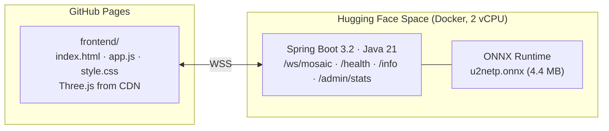
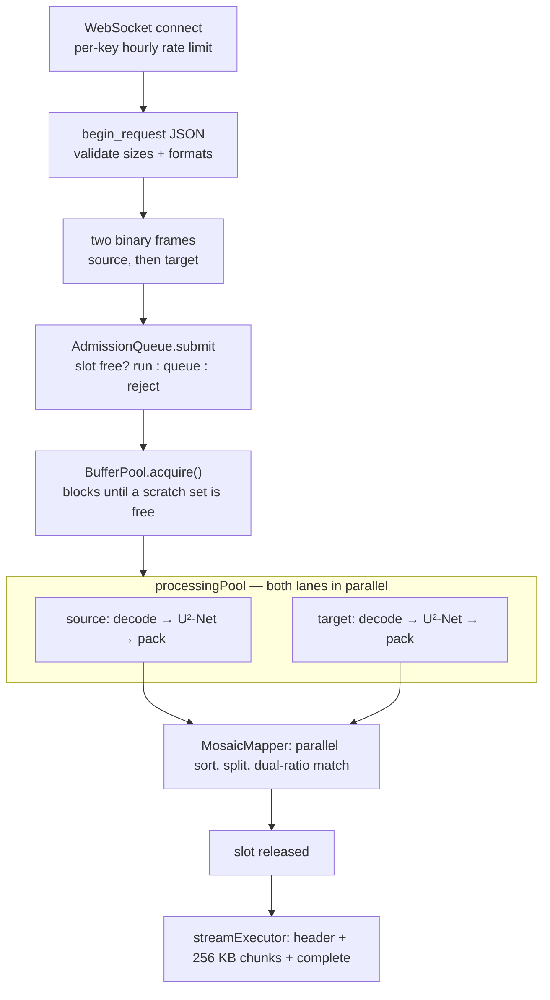
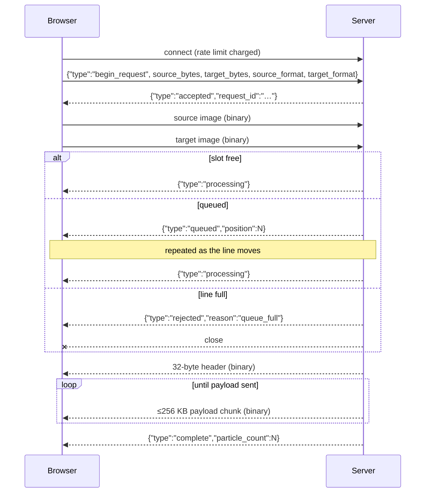

# Pixel Mosaic — Architecture

This document describes the system as it is built. It covers the data representation, the
server pipeline, the wire protocol, the browser renderer, and the concurrency, memory and
safety budgets that make it survivable on a free single-container host.

For how to run it, see [README.md](README.md).

---

## 1. What the system does

Pixel Mosaic takes two images — a **source** and a **target** — and reconstructs the target
using only pixels taken from the source. Every pixel of the output is a real source pixel,
moved to a new coordinate. No colour is invented, blended or interpolated.

The pairing is not arbitrary. Both images are split into subject and background with a saliency
model, and within each of those two groups pixels are ordered by brightness then hue. Source and
target are then matched rank-for-rank. The practical effect: the target's subject is rebuilt from
the source's subject, its background from the source's background, and light areas get light
pixels.

The browser receives the pairing, not an image. It animates every source pixel flying from its
original coordinate to its mapped coordinate, and can rasterise the final frame to a PNG.

### Accepted consequences

- The target's **geometry is exact**. Every target coordinate receives exactly one source pixel,
  so silhouettes and edges survive intact.
- The source's **spatial arrangement is destroyed**. Only its palette survives.
- The output's colour range is the source's colour range. A monochrome source cannot produce a
  colourful mosaic.
- Particle count equals the target's pixel count, so the source is sampled with repetition when
  it is smaller than the target, and sampled sparsely when it is larger.

---

## 2. Topology



Two independently deployed halves, no shared state and no database:

| Half | Lives in | Deployed by | Hosted at |
| --- | --- | --- | --- |
| Static client | `frontend/` | `.github/workflows/pages.yml` | GitHub Pages |
| Backend | `src/`, `Dockerfile` | `.github/workflows/docker-publish.yml` → GHCR; Space tracks its own branch | Hugging Face Space |

`.github/workflows/keep-awake.yml` pings `/health` every 12 hours so the Space does not go cold
between visitors.

The client picks its endpoint from the hostname: `ws://localhost:8080/ws/mosaic` when served from
`localhost` or `127.0.0.1`, otherwise `wss://shreyasvn-pixel-mosaic.hf.space/ws/mosaic`
(`CONFIG.WS_URL` in `frontend/app.js`).

### Backend packages

```
com.pixelmosaic
├── PixelMosaicApplication      Spring Boot entry point
├── ws/MosaicWebSocketHandler   protocol state machine, framing, client-IP resolution
├── pipeline/
│   ├── MosaicPipeline          forks both lanes, joins, calls the mapper
│   ├── ImageProcessor          one lane: decode → mask → pack
│   ├── ImageDecoder            bounded ImageIO decode + downscale
│   ├── OnnxMaskGenerator       U²-Net inference, threshold, morphology
│   ├── PixelUtils              the 64-bit key: field maths, pack, unpack, split search
│   ├── MosaicMapper            sort, split, dual-ratio match, payload writing
│   ├── BufferPool              fixed set of preallocated RequestBuffers
│   ├── RequestBuffers          per-request scratch arrays
│   └── MosaicResult            payload + dimensions + particle count
├── admission/
│   ├── AdmissionQueue          bounded FIFO with live position callbacks
│   └── RateLimiterService      Caffeine hourly counter per client key
├── stats/UsageStats            processed counter + start time
├── web/                        HealthController, AdminController
└── config/                     AppConfig (beans, pools), WebSocketConfig, OnnxSessionFactory, ModelLoader
```

---

## 3. The 64-bit pixel key

Every pixel of both images becomes one `long`. Sorting that `long` array is the whole matching
algorithm — there is no separate comparator, no bucketing pass and no object allocation per pixel.

```
 bit  63      62────56   55────────40   39──32   31────16   15─────0
     ┌───────┬──────────┬─────────────┬────────┬──────────┬─────────┐
     │ FG/BG │ luminance│     hue     │  hash  │    X     │    Y    │
     │ 1 bit │  7 bits  │   16 bits   │ 8 bits │ 16 bits  │ 16 bits │
     └───────┴──────────┴─────────────┴────────┴──────────┴─────────┘
```

`PixelUtils.packSource` and `PixelUtils.packTarget` produce identical layouts; both exist so the
two lanes read symmetrically at the call site.

### Why this layout

Field order is significance order. A plain unsigned comparison of two keys compares subject
membership first, then brightness, then hue, then the dither hash, and only then position. That
is exactly the pairing rule, so `Arrays.sort(long[])` — a primitive dual-pivot quicksort with no
boxing — implements it.

Bit 63 is the sign bit, so foreground pixels (`FG = 1`) sort as negative values and land at the
**front** of the sorted array. `PixelUtils.findFgBgSplit` binary-searches for the first
non-negative element: indices `[0, split)` are foreground, `[split, len)` are background. Two
contiguous lanes, found in O(log n), with no second pass over the data.

### Field computation

**Luminance — 7 bits, `0..127`.** Rec. 709 relative luminance of the sRGB triple, quantised:

```
y   = 0.2126·R + 0.7152·G + 0.0722·B      // [0, 255]
lum = (int)(y / 255 · 127)                // [0, 127]
```

7 bits is deliberate: it leaves bit 63 for the subject flag, and ~128 brightness buckets is finer
than the eye resolves while still being coarse enough that the hue field below it does real work
within each bucket.

**Hue — 16 bits, `0..65535`.** Standard HSV hue over the sRGB triple. Near-grey pixels have no
meaningful hue, so when `max − min < 0.04` the field is set to the sentinel `65535`; chromatic
hues are mapped to `0..65534` so they can never collide with it. Greys therefore collect at the
end of each luminance bucket instead of being scattered by numerical noise.

**Spatial hash — 8 bits.** `(x · 2654435761 ^ y · 40503) & 0xFF`. A tiebreaker, not a feature.
Pixels that agree on subject, luminance and hue would otherwise sort by X then Y, which maps
whole runs of a flat region to one contiguous run of the source and produces visible banding. The
hash shuffles those ties deterministically, scattering the choice of source pixel inside each
equivalence class.

**X and Y — 16 bits each.** The payload coordinate. Capped at 65535 per axis, which is also
`ImageDecoder.MAX_DIMENSION`.

---

## 4. Request lifecycle



### 4.1 Startup (once)

`AppConfig` builds the singletons. The U²-Net model is copied out of the jar
(`classpath:models/u2netp.onnx`) to a temp file marked `deleteOnExit`, because ONNX Runtime loads
from a path, and one `OrtSession` is created for the whole process:

```java
opts.setIntraOpNumThreads(1);
opts.setInterOpNumThreads(1);
opts.setOptimizationLevel(OptLevel.ALL_OPT);
opts.setMemoryPatternOptimization(true);
opts.setExecutionMode(ExecutionMode.SEQUENTIAL);
```

Single-threaded inference is intentional on a 2 vCPU box: parallelism comes from running the two
lanes of a request concurrently, so letting ORT also fan out would oversubscribe the CPU and add
contention without reducing latency. The session is thread-safe and shared across all lanes.

`BufferPool` allocates its `RequestBuffers` here too, so the steady-state heap is reached at
startup rather than under load (§7).

### 4.2 Connection and admission

On connect, `MosaicWebSocketHandler` wraps the session in a
`ConcurrentWebSocketSessionDecorator` (30 s send time limit, `4 × chunkSize` = 1 MB send buffer) —
necessary because the processing thread sends control frames while the stream thread sends
payload. Then it resolves a rate-limit key and charges one request against it:

- `trusted-proxy-hops = 0` → the TCP remote address. This is the Space's configuration: the
  Hugging Face edge does not pass a forwarded chain the app can trust, so the connection address
  is the only honest signal.
- `trusted-proxy-hops = n > 0` → `X-Forwarded-For`, flattened across headers, taking the entry
  `n` hops from the right. Only the hops a known proxy appends can be trusted; anything further
  left is client-supplied.
- IPv4 keys are the address verbatim; IPv6 keys are truncated to the `/64` prefix
  (`MosaicWebSocketHandler.rateLimitKey`), since a single subscriber routinely holds a whole /64
  and per-address limiting would be trivially evaded.

Over the limit closes the socket with status `1008`. `RateLimiterService` keeps the counters in
Caffeine with `expireAfterWrite(1h)` and `maximumSize(100_000)`, so the memory cost is bounded
and no sweeper thread is needed.

### 4.3 Handshake and upload

The session advances through `AWAITING_BEGIN → AWAITING_SOURCE → AWAITING_TARGET → PROCESSING`.
Any frame arriving out of order closes the connection. `begin_request` is validated before a
single image byte is accepted: both declared sizes must be in `(0, max-image-bytes]`, and both
declared formats must be in `{image/jpeg, image/png, image/webp}`. The client gets `accepted`
with a request id, then sends two binary frames.

Rejecting on the declared size is cheap and correct: the container's own binary buffer is capped
at `max-image-bytes + 1 KB`, so an oversized frame cannot be assembled anyway.

### 4.4 Admission

`AdmissionQueue.submit` either starts the job (`running < max-concurrent`), parks it in a FIFO
(`waiting.size() < max-queued`), or refuses it. A refusal sends `rejected / queue_full` and
closes — a bounded refusal is a better experience than an unbounded wait.

Queued jobs get a `queued` frame with their position, and the whole waiting list is re-notified
whenever the line moves. `MosaicJob.onQueuePosition` suppresses stale and non-monotonic updates,
so a client's displayed position only ever counts down. Closing the socket while queued calls
`AdmissionQueue.cancel`, which removes the job and renumbers the rest.

### 4.5 Parallel fork: decode → mask → pack

`MosaicPipeline.process` takes one `RequestBuffers` from the pool — blocking if all are in use,
which is the backstop that keeps memory flat even if admission is misconfigured — then runs both
lanes on `processingPool` and joins.

Each lane is `ImageProcessor.process`:

**Decode (`ImageDecoder`).** Three guards, cheapest first:

1. Byte length against `MAX_BYTES` (10 MB).
2. Header-only `width × height` against `MAX_SOURCE_PIXELS` (100 MP), read via `ImageReader`
   before any pixel is decoded. This is the decompression-bomb defence: a 50 KB PNG declaring
   30000×30000 is refused without ever allocating its raster.
3. `ImageReadParam.setSourceSubsampling(step, step)` with
   `step = floor(sqrt(w·h / max-pixels))`, so an oversized image is decimated **by the decoder**
   and the full-resolution raster is never materialised.

The decoded `BufferedImage` is converted to packed ARGB `int[]` by `extractArgb`, which reads the
backing `DataBuffer` directly for the common layouts (`INT_ARGB`, `INT_RGB`, `INT_BGR`,
`3BYTE_BGR`, `4BYTE_ABGR`, `BYTE_GRAY`) and falls back to drawing into a `TYPE_INT_ARGB` image
for anything exotic. Subsampling is integer-only, so a final `bilinearResize` brings the result
to exactly `≤ max-pixels` and `≤ 65535` per axis.

**Mask (`OnnxMaskGenerator`).** Nearest-neighbour resize to 320×320, ImageNet normalisation
(`mean .485/.456/.406`, `std .229/.224/.225`) into a CHW `float[3·320·320]`, copied into a
direct `FloatBuffer` so ORT reads it without another copy. The first output tensor is thresholded
at `> 0.5`, nearest-upsampled to full resolution, then cleaned with a morphological **open then
close** using a 3×3 border-clamped kernel — open removes speckle outside the subject, close fills
pinholes inside it. The result is a `BitSet` of `width × height`.

Nearest-neighbour is the right choice at both ends here: the input is about to be mangled by a
saliency net that does not care about resampling quality, and the output is a binary mask where
interpolation would only invent intermediate values that the threshold then discards.

**Pack.** One pass over the raster writing `data[p] = pack(fg, lum, hue, hash, x, y)`.

### 4.6 Join, sort and map (`MosaicMapper`)

Both lanes are sorted concurrently (`Arrays.sort` per lane on the common pool), then
`findFgBgSplit` locates each lane's boundary.

If all four lanes are non-empty, two independent ratios are computed and each target pixel pulls
from its own lane:

```java
fgRatio = srcSplit / tgtSplit;
bgRatio = (srcLen - srcSplit) / (tgtLen - tgtSplit);

i <  tgtSplit:  srcIdx = clamp((int)(i * fgRatio),                  0,        srcSplit - 1)
i >= tgtSplit:  srcIdx = clamp(srcSplit + (int)((i-tgtSplit)*bgRatio), srcSplit, srcLen - 1)
```

Two ratios rather than one is what keeps the subject intact. A single global ratio would let
background pixels bleed into the subject whenever the two images disagree about how much of the
frame the subject occupies — which is the normal case. Both branches clamp because float
multiplication at the top of a lane can round past its last index.

**Degenerate fallback.** If any of the four lanes is empty — a fully-salient image, or one the
model found nothing in — the dual-ratio arithmetic would divide by zero. `mapSingleLane` then
treats each image as one undivided lane with `ratio = srcLen / tgtLen` and logs a warning. The
subject/background guarantee is lost; brightness and hue ordering still holds.

`writeParticle` resolves the source pixel's true colour from `sourceRaster` (the key carries
quantised luminance and hue, never the colour itself) and writes 7 bytes at
`(tgtY · tgtWidth + tgtX) · 7`. Writing **in target raster order** is what shrinks the particle:
the target coordinate is implied by the slot, so only the source coordinate and the RGB triple
need to be on the wire.

`logStats` samples 1000 target indices with a fixed seed and reports how many distinct source
indices they hit — a cheap diversity check for whether the mapping is degenerating into a few
repeated pixels.

### 4.7 Release and stream

`MosaicJob.run` hands the finished `MosaicResult` to `streamExecutor` and returns, which releases
the admission slot. **Processing holds a slot; streaming does not.** A client on a slow link
cannot block the queue — the alternative would let one mobile connection idle a scarce
compute slot for the length of a 14 MB transfer.

The stream thread sends the 32-byte header, then the payload as independent 256 KB binary
messages, then `complete`. A send failure logs at INFO and closes the socket; a disconnected
client is a normal event, not an error.

Note that the `RequestBuffers` are released as `process` returns, while the payload — a fresh
direct `ByteBuffer` — stays alive until the stream finishes. The scratch arrays are recycled;
the payload cannot be, because its lifetime is the client's.

---

## 5. Wire protocol

One mosaic per WebSocket connection, at `/ws/mosaic`. Control frames are JSON text; images and
payload are binary. All multi-byte integers are **big-endian** (Java's `ByteBuffer` default; the
client reads with `DataView` and `littleEndian = false`).



### Header — 32 bytes

| Offset | Size | Field |
| --- | --- | --- |
| 0 | 4 | magic `0x4D4F5302` |
| 4 | 4 | protocol version (`1`) |
| 8 | 4 | particle count = `tgtWidth × tgtHeight` |
| 12 | 4 | source width |
| 16 | 4 | source height |
| 20 | 4 | target width |
| 24 | 4 | target height |
| 28 | 4 | reserved (`0`) |

### Particle — 7 bytes

| Offset | Size | Field |
| --- | --- | --- |
| 0 | 2 | source X (`uint16`) |
| 2 | 2 | source Y (`uint16`) |
| 4 | 1 | red |
| 5 | 1 | green |
| 6 | 1 | blue |

Particle `i` is the target pixel at `(i mod tgtWidth, floor(i / tgtWidth))`. Total payload is
`particleCount × 7` bytes — 14 MB at the 2 MP cap. Each 256 KB chunk is its own WebSocket
message, so the client can report progress and the container never has to buffer a single
multi-megabyte frame.

### Errors

Every failure is a single JSON frame followed by a close. `error` reasons:
`expected_begin_request`, `invalid_json`, `unexpected_message`, `source_too_large`,
`target_too_large`, `unsupported_source_format`, `unsupported_target_format`, `invalid_image`,
`processing_failed`. `rejected` reasons: `queue_full`. Close code `1008` means the hourly rate
limit was exceeded; `1002` an unexpected binary frame.

`MosaicWebSocketHandler.reportFailure` maps `IllegalArgumentException` and `IOException` from the
pipeline to `invalid_image` (the client's fault, logged at WARN) and everything else to
`processing_failed` (ours, logged at ERROR with the stack trace). The client translates these to
sentences in `ERROR_MESSAGES`; raw reason strings never reach the UI.

---

## 6. Frontend

A single page, no build step, no framework. `frontend/app.js` is an ES module importing Three.js;
the page must be served over HTTP because browsers refuse module imports from `file://`.

### State machine

`EMPTY → READY → WORKING → ANIMATING → DONE`, with `ERROR` reachable from anywhere. `setState`
owns all DOM visibility: it hides every `.state-panel`, shows `state-<name>`, and gates the
Generate and Download buttons. Entering `ANIMATING` is what starts the renderer.

### Client-side downscale

`prepareUpload` reads the file with `createImageBitmap`, and if it exceeds
`MAX_UPLOAD_PIXELS` (2 MP) redraws it to the scaled size on an `OffscreenCanvas` and re-encodes —
PNG stays PNG, everything else becomes JPEG at quality 0.9. Images already under the cap are
uploaded untouched.

The server would downscale anyway, so this is about the upload: a 10 MB phone photo becomes a few
hundred KB, which is the difference between a usable and an unusable experience on mobile. If
`createImageBitmap` or `OffscreenCanvas` is missing, or either throws, it falls back to the
original bytes and the server does the work. A per-slot token guards against a user picking a
second file while the first is still being resized.

### Receive and parse

Binary frames are accumulated as `ArrayBuffer`s; the first is the header, which also sets the
canvas `aspect-ratio` to the target's so the layout settles before the animation starts. On
`complete` the chunks are concatenated once and `parsePayload` fans the bytes out into the typed
arrays the GPU wants:

```js
startX[i] = view.getUint16(off)     / srcW;   // normalised [0,1]
startY[i] = view.getUint16(off + 2) / srcH;
endX[i]   = (i % tgtW) / tgtW;                // implied by the slot
endY[i]   = Math.floor(i / tgtW) / tgtH;
colors[i*3 .. i*3+2] = bytes 4,5,6 / 255;
```

### Renderer

`MosaicRenderer` builds one `THREE.Points` over an `InstancedBufferGeometry` with
`instanceCount = particleCount` and five instanced attributes (`aStartX`, `aStartY`, `aEndX`,
`aEndY`, `aColor`). A `RawShaderMaterial` keeps Three.js from injecting its standard uniform
preamble. An `OrthographicCamera(-1, 1, 1, -1, 0, 1)` makes clip space the unit square, so the
normalised coordinates map to NDC with one multiply-add.

One draw call moves two million particles. Positions are interpolated on the GPU from the start
and end attributes, so no buffer is ever re-uploaded during the animation; the only per-frame
work on the CPU is writing `uProgress`.

Vertex shader:

```glsl
float adjustedProgress = max(0.0, (uProgress - uHoldTime) / (1.0 - uHoldTime));
float t = easeOutExpo(clamp(adjustedProgress, 0.0, 1.0));
float x =  mix(aStartX, aEndX, t) * 2.0 - 1.0;
float y = -(mix(aStartY, aEndY, t) * 2.0 - 1.0);   // image Y is top-down, GL is bottom-up
gl_Position  = vec4(x, y, 0.0, 1.0);
gl_PointSize = mix(uStartSize, uEndSize, t);
```

`uHoldTime` is `HOLD_MS / ANIMATION_DURATION_MS` = 0.1, so the source image holds for one second
before it flies apart — long enough to register what the source was. `easeOutExpo` puts most of
the travel in the first moments; the long tail is what reads as pixels "settling" into the target.

`computePointSizes` sizes a particle from its real pixel spacing:
`ceil(max(bufferWidth / imageWidth, bufferHeight / imageHeight))`, clamped to the GL
`ALIASED_POINT_SIZE_RANGE` maximum and recomputed on resize. Points are sized independently for
the start and end images and interpolated, because a small target spread over a large canvas
needs several device pixels per particle to render solid rather than as a sparse dot grid.

The fragment shader discards fragments outside a radius that grows with `t`
(`dot(coord,coord) > mix(0.25, 0.5, vT)`): tight circles while the source image is legible,
wider discs on arrival so neighbours overlap and the mosaic reads as continuous. Depth test and
write are off — the particles are coplanar, so depth would only cost bandwidth.

### Download

`downloadMosaic` writes the final frame straight into an `ImageData` at the target's exact
dimensions and converts to a PNG blob. This rasterises the mapping rather than reading the
canvas back, so the PNG is pixel-exact and independent of canvas size, device pixel ratio and the
particle radius the animation used.

---

## 7. Concurrency and memory

### Thread pools (`AppConfig`)

| Bean | Size | Queue | Role |
| --- | --- | --- | --- |
| `requestExecutor` | `max-concurrent` (2) | unbounded | runs admitted jobs; bounded by `AdmissionQueue`, so the queue never fills |
| `processingPool` | 4 | `ArrayBlockingQueue(10)` | the two lanes of each job — 2 concurrent × 2 lanes |
| `streamExecutor` | `max-streams` (16) | unbounded | payload streaming, decoupled from compute slots |
| Tomcat | 50 max, 10 min-spare | — | HTTP + WebSocket I/O |
| ForkJoin common pool | — | — | the two `Arrays.sort` calls in `MosaicMapper` |

All application pools use daemon threads so the JVM is never held open by an idle worker.

### Heap

`RequestBuffers`, at `max-pixels = 2,000,000`:

| Array | Size |
| --- | --- |
| `sourceData`, `targetData` — `long[2M]` | 16 MB each |
| `sourceRaster`, `targetRaster` — `int[2M]` | 8 MB each |
| `sourceMask`, `targetMask` — `BitSet(2M)` | ~250 KB each |
| **per buffer** | **~48.5 MB** |
| **× `max-concurrent` = 2** | **~97 MB** |

Preallocated at startup and recycled for the life of the process. Two million pixels per image is
the number everything else is sized against: it is enough that a mosaic looks like a photograph,
and small enough that this table stays well inside a free container.

Transient per lane during processing: the decoded `int[]` before the copy into the pooled raster
(up to 8 MB), the `BufferedImage` behind it, and the mask's working set — a `float[3·320²]`
input (1.2 MB), the output `float[320²]`, and three full-resolution `boolean[]` buffers for the
threshold, open and close passes (~2 MB each). These are ordinary short-lived garbage.

### Direct memory

The payload is `ByteBuffer.allocateDirect(particleCount × 7)` — up to 14 MB per mosaic, held
from the end of mapping until the stream finishes. ONNX Runtime also holds its own native arena
outside the heap.

The container runs with `-Xmx2g -XX:MaxDirectMemorySize=512m`, which leaves room for ORT's native
allocations plus the worst case of 2 in-flight payloads and a backlog of streams.

---

## 8. Limits and hardening

| Guard | Value | Where | Against |
| --- | --- | --- | --- |
| Declared size check | 10 MB per image | `validateBegin` | oversized uploads, before any bytes |
| Container binary buffer | 10 MB + 1 KB | `WebSocketConfig` | oversized frames at the transport |
| Container text buffer | 8 KB | `WebSocketConfig` | oversized control frames |
| Byte length check | `MAX_BYTES` 10 MB | `ImageDecoder` | same, at the decoder |
| Header pixel check | 100 MP | `ImageDecoder` | decompression bombs, before decoding |
| Decoder subsampling | to `max-pixels` | `ImageDecoder` | materialising a huge raster |
| Dimension clamp | 65535 per axis | `ImageDecoder` | the 16-bit coordinate fields |
| Format allowlist | JPEG, PNG, WebP | `validateBegin` | unexpected ImageIO codecs |
| Rate limit | 30/hour per key | `RateLimiterService` | one client monopolising the Space |
| Concurrency | 2 running, 8 waiting | `AdmissionQueue` | memory and CPU exhaustion |
| Buffer pool | 2 buffer sets | `BufferPool` | memory, even if admission is misconfigured |
| Send time limit | 30 s | session decorator | stalled clients pinning a stream thread |
| Origin allowlist | `allowed-origins` | `WebSocketConfig`, CORS | cross-origin use of the Space |
| Admin token | constant-time compare | `AdminController` | token guessing; 404 when unset |

`/admin/stats` returns **404**, not 401, when the token is unset or wrong — an endpoint that
denies its own existence cannot be probed for the shape of a valid token.

### Configuration (`application.yml`)

| Key | Default | Meaning |
| --- | --- | --- |
| `server.port` | `${PORT:8080}` | 7860 in the container, for Hugging Face |
| `pixelmosaic.model-path` | `classpath:models/u2netp.onnx` | ONNX model location |
| `pixelmosaic.max-concurrent` | 2 | mosaics processed at once; also the buffer-pool size |
| `pixelmosaic.max-queued` | 8 | waiting requests before `queue_full` |
| `pixelmosaic.max-streams` | 16 | concurrent payload streams |
| `pixelmosaic.rate-limit-per-hour` | 30 | requests per client key per hour |
| `pixelmosaic.trusted-proxy-hops` | 0 | proxies that append to `X-Forwarded-For`; 0 = use the connection address |
| `pixelmosaic.admin-token` | `${ADMIN_TOKEN:}` | empty disables `/admin/stats` |
| `pixelmosaic.max-image-bytes` | 10485760 | per-image upload cap |
| `pixelmosaic.max-pixels` | 2000000 | working resolution per image |
| `pixelmosaic.chunk-size-bytes` | 262144 | payload chunk size |
| `pixelmosaic.allowed-origins` | localhost + the Pages origin | WebSocket and CORS allowlist |

### HTTP endpoints

| Endpoint | Returns |
| --- | --- |
| `GET /health` | `OK` — used by the keep-awake workflow |
| `GET /info` | version, `maxConcurrent`, whether the model loaded |
| `GET /admin/stats` | processed count and start time; needs `X-Admin-Token` |

---

## 9. Tests

```bash
mvn test
```

| Test | Covers |
| --- | --- |
| `PixelUtilsTest` | luminance and hue edges, the achromatic sentinel, pack/unpack round trips, split search |
| `ImageDecoderTest` | oversize rejection, decompression bomb, garbage input, downscale, subsampled decode, bilinear correctness |
| `MosaicMapperTest` | dual-lane mapping, target raster order, degenerate fallback, index bounds |
| `OnnxMaskGeneratorTest` | mask dimensions and thresholding |
| `AdmissionQueueTest` | queueing past concurrency, rejection past the queue, cancellation renumbering the line |
| `RateLimitKeyTest` | IPv4 verbatim, IPv6 collapsed to `/64` |
| `WebSocketIntegrationTest` | full round trip against an embedded server with synthetic PNGs |
| `PipelineSmokeTest` | a `main` for eyeballing mapping statistics on real images |

`WebSocketIntegrationTest` and `OnnxMaskGeneratorTest` need the model on the classpath and
disable themselves via `ModelLoader.isAvailable()` when it is absent.

---

## 10. Trade-offs and known limits

- **Mapping is rank-based, not perceptual.** Pixels are matched by sorted position within a lane,
  not by colour distance. A nearest-neighbour match in Lab space would look better and cost far
  more than one sort; the subject split plus brightness ordering carries most of the quality.
- **Saliency is binary.** One threshold at 0.5, two lanes. Soft mattes and multiple subjects are
  out of scope.
- **The hue field is unused for greys.** By design — all near-greys share the sentinel and are
  separated only by luminance and the dither hash.
- **No persistence.** No accounts, no stored images, no history. `UsageStats` is an in-memory
  counter that resets on restart.
- **One mosaic per connection.** No reuse; the client reconnects for each generate.
- **Cold starts.** The free Space suspends when idle; the first request after a suspension waits
  for the container and the ONNX session. The keep-awake workflow reduces but does not remove
  this.
- **`max-pixels` bounds everything.** Working resolution, heap, payload size and the download are
  all derived from it. Raising it means re-deriving §7.

---

## 11. Stack

| Layer | Choice |
| --- | --- |
| Language | Java 21 |
| Framework | Spring Boot 3.2.5 (`spring-boot-starter-websocket`) |
| Inference | ONNX Runtime 1.17.3, U²-Net (`u2netp`, 4.4 MB) |
| Imaging | ImageIO + TwelveMonkeys 3.10.1 (JPEG, WebP) + jai-imageio-core 1.4.0 |
| Caching | Caffeine |
| Client | Three.js (WebGL), vanilla ES modules, no build step |
| Container | `maven:3.9-eclipse-temurin-21` → `eclipse-temurin:21-jre`, multi-stage |
| CI/CD | GitHub Actions → GitHub Pages and GHCR; Hugging Face Space for the backend |

---

Released under the [MIT License](LICENSE).
