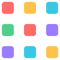

<p align="center">
  
</p>

<h1 align="center">Pixel Mosaic</h1>

<p align="center">
  <strong>Reconstruct any image using only the pixels of another</strong> — streamed to your
  browser as a live WebGL particle storm.
</p>

<p align="center">
  <a href="https://shreyasnandurkar.github.io/pixel-mosaic/"></a>
  <a href="https://huggingface.co/spaces/shreyasvn/pixel-mosaic"></a>
  <a href="LICENSE"></a>
</p>

<p align="center">
  
  
  
  
</p>

---

Give Pixel Mosaic two photos — a **source** and a **target**. It extracts the subject of the
target with an AI saliency model, then rebuilds that shape out of thousands of individual pixels
lifted from the source image. The result streams to your browser and plays back as a
ten-second animation: every pixel of one photo flies into the silhouette of the other.

> **Two photos in, one pixel storm out.** No sign-up, no install — just open the demo.

### ▶ [**Try the live demo →**](https://shreyasnandurkar.github.io/pixel-mosaic/)

<br/>

## ✨ Features

- **Real-time particle rendering** — a Three.js instanced-points engine animates every pixel on the GPU with custom vertex/fragment shaders, holding the source image for a beat before the pixels fly into the target's shape.
- **AI subject extraction** — a [U²-Net](https://github.com/xuebinqin/U-2-Net) saliency model (via ONNX Runtime) masks the target so only its subject is reconstructed.
- **Binary streaming protocol** — results are pushed over a WebSocket as a compact 32-byte header plus 256 KB binary chunks, so the animation starts as soon as data arrives.
- **Built for concurrency** — a dual-lane processing pipeline, buffer pooling, and a global concurrency semaphore keep latency low under load, with per-IP rate limiting on top.
- **Fully hosted** — static frontend on GitHub Pages, containerized backend on a Hugging Face Space.

<br/>

## 🎬 How it works

```
Upload source + target
        │
        ▼
 decode  →  U²-Net saliency mask  →  bitwise pixel pack
                                            │
                                            ▼
                        concurrent dual-lane sort / map
                                            │
                                            ▼
              32-byte binary header  +  256 KB chunked stream
                                            │
                                            ▼
        Three.js instanced-points animation in the browser
```

For the full design — memory budgets, the wire protocol, concurrency model, and pipeline
stages — see **[ARCHITECTURE.md](ARCHITECTURE.md)**.

<br/>

## 🧱 Tech stack

| Layer | Technology |
| --- | --- |
| Frontend | Three.js (WebGL), vanilla JS, static hosting on GitHub Pages |
| Backend | Java 21, Spring Boot 3.2, WebSocket streaming |
| AI | U²-Net saliency model on ONNX Runtime |
| Imaging | TwelveMonkeys + JAI ImageIO (JPEG / PNG / WebP) |
| Infra | Docker, Hugging Face Spaces, Caffeine rate limiting |

<br/>

## 🐳 Run it yourself

The app is meant to be used at the [live demo](https://shreyasnandurkar.github.io/pixel-mosaic/) —
but the backend is a self-contained Docker image if you want to host your own.

**Pull and run the published image:**

```bash
docker run --rm -p 8080:8080 ghcr.io/shreyasnandurkar/pixel-mosaic:latest
```

**Or build it from source:**

```bash
docker build -t pixel-mosaic .
docker run --rm -p 8080:8080 pixel-mosaic
```

Then open `frontend/index.html` — it automatically connects to the backend on `localhost:8080`.

<details>
<summary>Prefer plain Maven?</summary>

```bash
mvn spring-boot:run        # backend on http://localhost:8080
```

Requires JDK 21. The U²-Net model ships with the repo (`src/main/resources/models/`).
</details>

<br/>

## 📁 Project layout

```
frontend/                     # static WebGL client (deployed to GitHub Pages)
src/main/java/com/pixelmosaic/
  ├── ws/                     # WebSocket handler + binary protocol
  ├── pipeline/               # decode → mask → pack → sort/map → stream
  ├── admission/              # per-IP rate limiting
  └── config/                 # ONNX session, executors, buffer pool
Dockerfile                    # backend image (Hugging Face Space)
ARCHITECTURE.md               # full technical design
```

<br/>

## 📄 License

Released under the [MIT License](LICENSE) © 2026 Shreyas Nandurkar.

<p align="center"><sub>Made with ♥ — every pixel counts.</sub></p>
